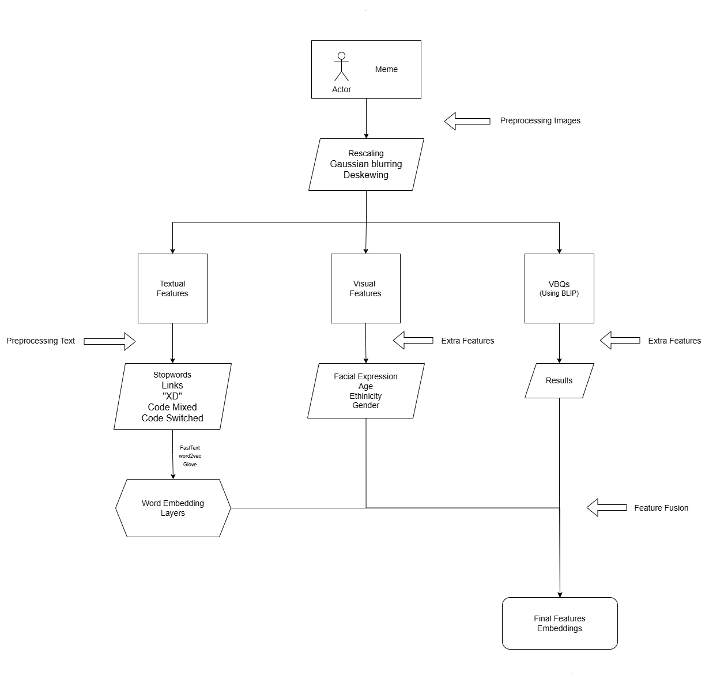
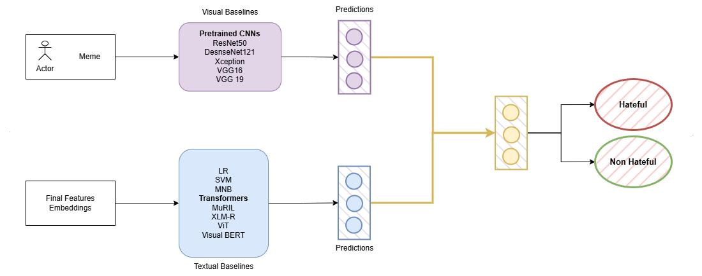

# Multi-Lingual Hateful Meme Detection

## Project Overview

This project addresses the growing challenge of detecting hateful memes across multiple languages on social media platforms. Hateful memes combine text and images to convey offensive messages that target individuals or groups based on characteristics such as race, gender, ethnicity, and religion. The detection of such content requires advanced multimodal analysis techniques that can interpret both visual and textual elements simultaneously.

## Table of Contents

- [Problem Statement](#problem-statement)
- [Dataset](#dataset)
- [Architecture](#architecture)
- [Demo Video](#demo-video)
- [Setup](#setup)
- [Methodology](#methodology)
  - [Pipeline-1: Multi-Modal Feature Extraction and Analysis](#pipeline-1-multi-modal-feature-extraction-and-analysis)
  - [Pipeline-2: Advanced Model Training and Ensemble Classification](#pipeline-2-advanced-model-training-and-ensemble-classification)
- [Models Implemented](#models-implemented)
- [Results](#results)
- [Limitations](#limitations)
- [Conclusion and Future Work](#conclusion-and-future-work)
- [References](#references)

## Problem Statement

Hateful content detection, especially in multimodal formats like memes, presents significant challenges due to:
- The complexity of interpreting combined visual and textual elements
- Multilingual content that requires cross-language understanding
- Nuanced and implicit hate speech that may not be apparent in either modality alone
- The need for robust automated detection systems that can scale to social media volumes

We define a hateful meme as content containing direct or indirect attacks on people based on protected characteristics, dehumanizing speech, statements of inferiority, calls for exclusion, or mockery of hate crimes.

## Dataset

The project utilizes a comprehensive dataset created by merging several existing datasets:

1. **MET-Meme Dataset**: 10,045 text-image pairs with manual annotations
   - 6,045 Chinese images
   - 4,000 English images

2. **CM-Offensive Meme Dataset**: 4,372 Hindi-English offensive memes

3. **Facebook Hateful Meme Dataset**: 10,000 multimodal examples specifically designed for hateful content detection

The final dataset comprises 26,432 images, with facial features extracted from 8,724 images to enrich the analysis capabilities.

## Architecture

The system employs a two-pipeline architecture for comprehensive meme analysis:


### Pipeline-1: Multi-Modal Feature Extraction and Analysis

This pipeline focuses on extracting and processing features from both textual and visual components of memes:



### Pipeline-2: Advanced Model Training and Ensemble Classification

This pipeline leverages the rich feature set created in Pipeline-1 to train multiple specialized models that are then combined through ensemble learning techniques:




### Requirements
```
python>=3.8
torch>=1.9.0
transformers>=4.12.0
deepface>=0.0.79
pillow>=8.3.1
opencv-python>=4.5.3
numpy>=1.20.0
pandas>=1.3.0
scikit-learn>=0.24.2
matplotlib>=3.4.3
seaborn>=0.11.2
```

### Installation
```bash
# Clone the repository
git clone https://github.com/DISHASONI99/Multi-Lingual-Hateful-Meme-Detection.git
cd Multi-Lingual-Hateful-Meme-Detection

# Create and activate a virtual environment (optional but recommended)
python -m venv venv
source venv/bin/activate  # On Windows: venv\Scripts\activate

# Install dependencies
pip install -r requirements.txt

# Run Streamlit UI
streamlit run app.py
```

### Running the System
```bash
# For training the models run each code in kaggle save and download the model 

# For evaluation run the ensemble model code

# For inference on new memes now run
streamlit run app.py
```

## Methodology

### Pipeline-1: Multi-Modal Feature Extraction and Analysis

#### Text Processing and Normalization
- **Text Extraction**: Optical character recognition to capture text from meme images
- **Language Normalization**: Converting all text to standard English
- **Text Preprocessing**: Removing stopwords, normalizing links, handling special characters ("XD"), and processing code-mixed content

#### Image Feature Extraction
- **Image Preprocessing**: Rescaling, Gaussian blurring, and deskewing
- **Facial Analysis**: Using DeepFace to extract demographic information (age, gender, ethnicity) and emotional expressions
- **Visual Question Answering**: Employing BLIP model to generate contextual understanding through targeted questions

#### Multi-modal Integration
- **Feature Fusion**: Combining word embeddings (FastText, Word2Vec, GloVe) with visual features
- **Consolidated Feature Set**: Creating rich representations that incorporate textual, visual, demographic, emotional, and contextual information

### Pipeline-2: Advanced Model Training and Ensemble Classification

#### Visual Baselines
- **Pretrained CNNs**: ResNet50, DenseNet121, Xception, VGG19, and VGG16 for deep visual feature extraction

#### Textual Baselines
- **Traditional ML Models**: Logistic Regression (LR), Support Vector Machines (SVM), and Multinomial Naive Bayes (MNB)
- **Transformer Models**: BERT, XLM-R, ViT, MuRIL, and Visual BERT

#### Ensemble Learning
- **Model Fine-tuning**: Optimizing all models on the custom dataset derived from Pipeline-1
- **Voting Ensemble**: Combining predictions through majority voting to leverage each model's strengths
- **Decision Fusion**: Aggregating predictions across different model types to reduce error

## Models Implemented

### 1. ResNet50-BERT Multimodal Model
- **Architecture**: Combines ResNet50 for image features (2048-dim) and BERT for text features (768-dim)
- **Feature Fusion**: Concatenation with a multi-layer classification head
- **Performance**: 79.79% accuracy, 0.80 F1 score

### 2. DenseNet121-BERT Classifier
- **Architecture**: Combines DenseNet121 for image features (1024-dim) and BERT for text features (768-dim)
- **Performance**: 80.86% accuracy, 0.81 F1 score

### 3. Bidirectional LSTM (BiLSTM)
- **Architecture**: Processes text sequences in both directions with embedding layer, two BiLSTM layers, and dense layers
- **Performance**: 70.01% accuracy, 0.69 F1 score

### 4. MuRIL Multimodal Classifier
- **Architecture**: Combines MuRIL (for multilingual text) with a custom CNN for image processing
- **Performance**: 79.32% accuracy, 0.80 F1 score

### 5. XLM-R Text Classifier
- **Architecture**: Uses XLM-RoBERTa with enhanced classification head for multilingual text analysis
- **Performance**: 80.42% accuracy, 0.80 F1 score

### 6. ViT-BERT Multimodal Classifier
- **Architecture**: Combines Vision Transformer (ViT) for images with BERT for text
- **Performance**: 81.20% accuracy, 0.81 F1 score

### 7. Voting Ensemble
- **Architecture**: Combines predictions from all six models through majority voting
- **Performance**: 87.00% accuracy, 0.85 F1 score, 0.86 precision

## Results

The evaluation metrics for all models are as follows:

| Model | Accuracy | F1 Score | Precision |
|-------|----------|----------|-----------|
| BiLSTM | 70.01% | 0.69 | 0.68 |
| XLM-R | 80.42% | 0.80 | 0.80 |
| ViT-BERT | 81.20% | 0.81 | 0.81 |
| MuRIL | 79.32% | 0.80 | 0.81 |
| ResNet50 | 79.79% | 0.80 | 0.82 |
| DenseNet121 | 80.42% | 0.81 | 0.81 |
| **Voting Ensemble** | **87.00%** | **0.85** | **0.86** |

The Voting Ensemble significantly outperformed individual models, demonstrating the effectiveness of combining complementary approaches for this complex task.

## Limitations

Despite promising results, the system has several limitations:

- **Text Extraction Errors**: OCR inaccuracies can affect downstream text-based models
- **Translation Issues**: Converting non-English text to English may introduce semantic inaccuracies
- **Computational Complexity**: Multiple large-scale models increase memory and processing requirements
- **Dataset Imbalance**: Class imbalance may bias models toward the majority class
- **Interpretability Challenges**: Limited transparency in explaining predictions
- **Simple Voting**: Equal weighting in majority voting doesn't account for model confidence

## Conclusion and Future Work

The proposed system effectively combines diverse architectures for robust hateful meme detection across multilingual and multimodal inputs. By leveraging complementary strengths of different models through ensemble learning, we achieved significant improvements over single-model approaches.

### Future Work
- Replacing majority voting with trainable ensemble methods like stacking
- Expanding the dataset with more underrepresented languages
- Exploring lightweight transformer architectures for faster inference
- Improving model interpretability for better user trust
- Implementing active learning techniques to address class imbalance

## References

1. Abdullakutty, F. and Naseem, U., Decoding Memes: A Comprehensive Analysis of Late and Early Fusion Models for Explainable Meme Analysis.
2. Jing Ma, Rong Li, RoJiNG-CL at EXIST 2024: Leveraging Large Language Models for Multimodal Sexism Detection in Memes.
3. Ji, J., Lin, X., Naseem, U., CapAlign: Improving Cross Modal Alignment via Informative Captioning for Harmful Meme Detection.
4. Huang, J., Lyu, H., Pan, J., Wan, Z., Luo, J. (2024), Evolver: Chain-of-Evolution Prompting to Boost Large Multimodal Models for Hateful Meme Detection.
6. Li, L., et al., VisualBERT: A Simple and Performant Baseline for Vision and Language.
7. Conneau, A., et al., Unsupervised Cross-lingual Representation Learning at Scale.
8. Dosovitskiy, A., et al., An Image is Worth 16x16 Words: Transformers for Image Recognition at Scale.
9. Kakwani, D., et al., MuRIL: Multilingual Representations for Indian Languages.
10. Schuster, M., Paliwal, K.K., Bidirectional Recurrent Neural Networks.
11. He, K., Zhang, X., Ren, S., Sun, J., Deep Residual Learning for Image Recognition.
12. Huang, G., Liu, Z., Van Der Maaten, L., Weinberger, K.Q., Densely Connected Convolutional Networks.
14. Real-time Object Detection using YOLOv8.
15. Hansheng, Haar Cascades Classifier: A Light-weight Face Detection Technique.
16. Byte Explorer, DeepFace: A Library for Face Recognition and Facial Analysis.
